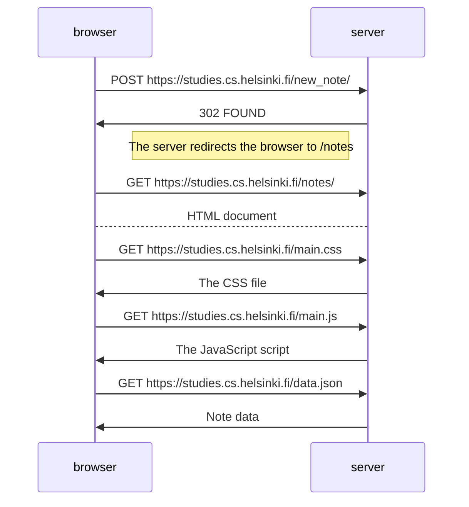

```mermaid
sequenceDiagram;
    participant browser
    participant server

    browser->>server: POST https://studies.cs.helsinki.fi/new_note/
    #activate server
    server->>browser: 302 FOUND
    #deactivate server

    Note left of server: The server redirects the browser to /notes

    browser->>server: GET https://studies.cs.helsinki.fi/notes/
    #activate server
    server-->browser: HTML document
    #deactivate server

    browser->>server: GET https://studies.cs.helsinki.fi/main.css
    #activate server
    server->>browser: The CSS file
    #deactivate server

    browser->>server: GET https://studies.cs.helsinki.fi/main.js
    #activate server
    server->>browser: The JavaScript script
    #deactivate server

    browser->>server: GET https://studies.cs.helsinki.fi/data.json
    #activate server
    server->>browser: Note data
    #deactivate server
```